# **Práctica: Análisis de evidencias en Android de un dispositivo rooteado.**

	 		AVISO : CONTENIDO EXCLUSIVAMENTE EDUCATIVO Y CON DATOS FICTICIOS.

Objetivo de la práctica ➜ Familiarizarse con el uso de herramientas de análisis forense en dispositivos Android rooteados.

Herramientas:

- **DB Browser for SQLite**: [https://sqlitebrowser.org/](https://sqlitebrowser.org/) 

- **ALEAPP**: [https://github.com/abrignoni/**ALEAPP**/releases](https://github.com/abrignoni/**ALEAPP**/releases)

➜ [Paloma Mareque Martínez](https://es.linkedin.com/in/paloma-mareque-mart%C3%ADnez-214701243)
#

### **1. ¿Cómo se llama la usuaria del dispositivo?**

Empezamos abriendo el informe que ALEAPP crea a partir del .tar(la evidencia lógica):
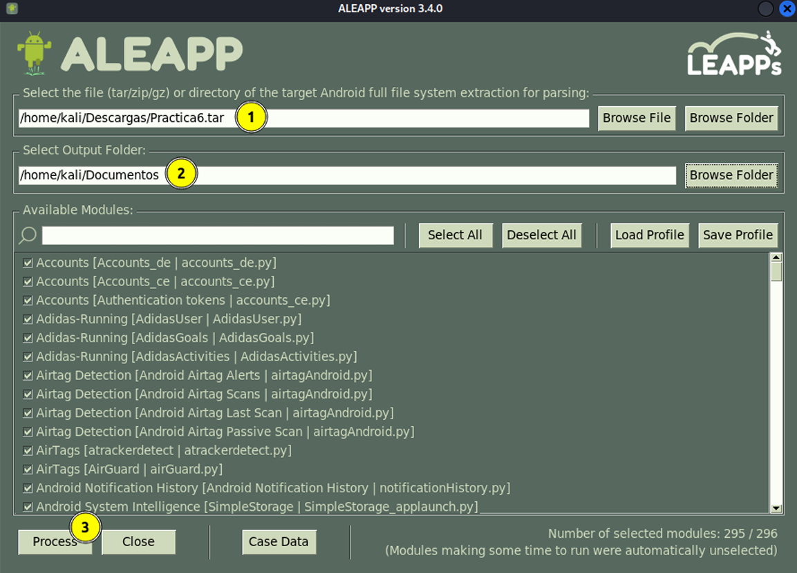
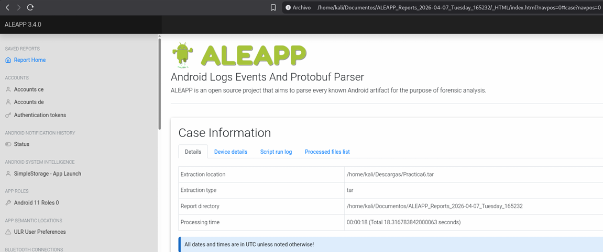
La usuaria del dispositivo se llama **Tina Louis**. En el informe generado por ALEAPP, este nombre aparece en las secciones Account Data y emails de la app de Gmail. En la captura de pantalla se muestra la ruta donde se encuentra toda la información de la cuenta del dispositivo(en la sección Account Data): *ALEAPP_Reports_2026-04-07_Tuesday_165232/data/data/data/com.google.android.apps.w ellbeing/files/AccountData.pb*
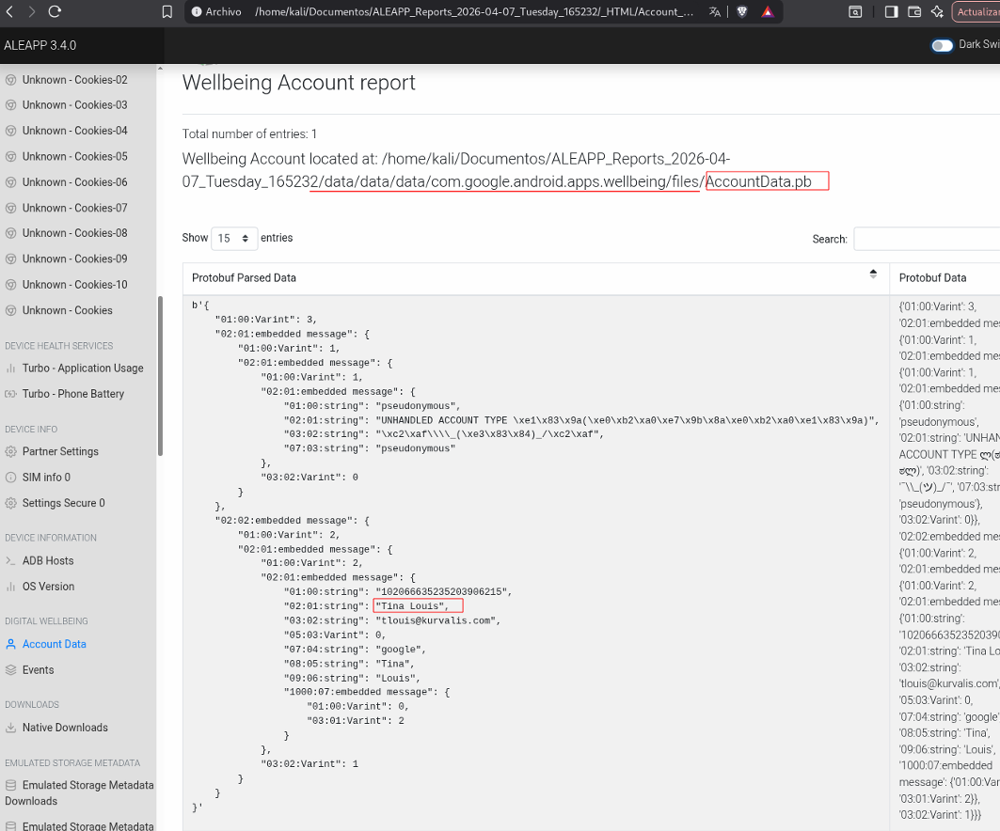

Y en esta captura se muestra la sección Gmail-App Emails, que contiene emails enviados y recibidos en la cuenta de Gmail de Tina Louis. La ruta de estos emails en la imagen es */data/data/com.google.android.gm/databases/bigTopDataDB.-310161650*
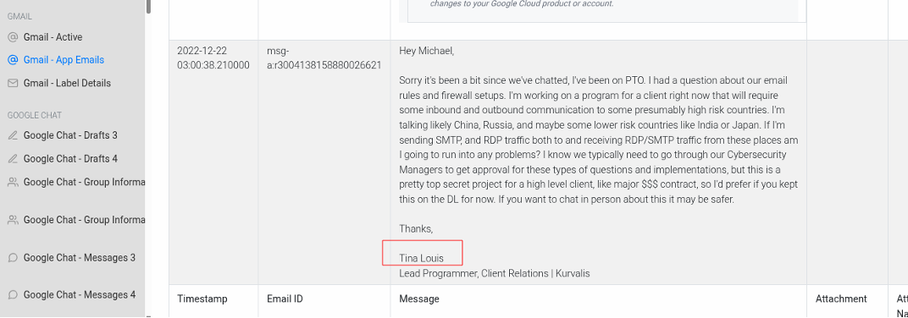

Otra prueba de que Tina Louis es el nombre de la usuaria está en los datos de ProtonMail, con el nombre de su cuenta de Twitter @LTina1900 :
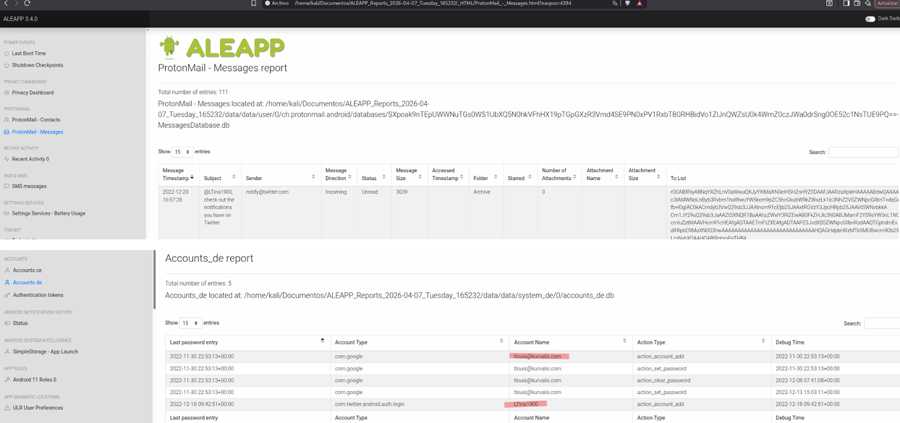

### **2. ¿Cuál es la contraseña de la WIFI Abo South?**

En la sección Wi-Fi Profiles aparecen todas las WIFI a las que se ha conectado el teléfono Android. Buscando en la tabla vemos la contraseña de la WIFI “Abo South” en la columna PreSharedKey: **Pepperoni**.
*/home/kali/Documentos/ALEAPP_Reports_2026-04-07_Tuesday_165232/data/data/misc/ape xdata/com.android.wifi/WifiConfigStore.xml*
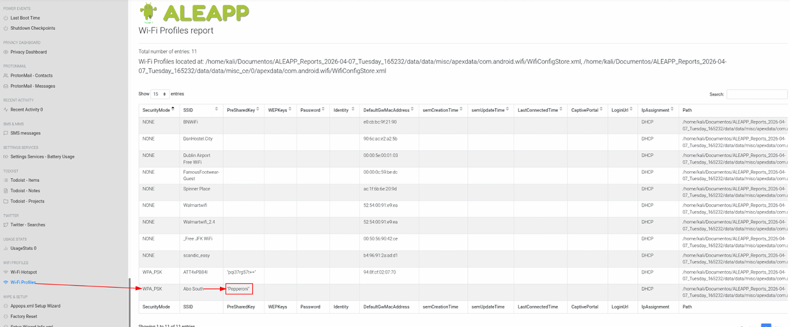

### **3. ¿Cuándo se realizó el último Factory Reset al dispositivo?**

Buscando en la sección Factory Reset, el último (y parece que único) Factory Reset que se realizó al dispositivo fue el día **2022-11-30 a las 22:37:07 horas**.
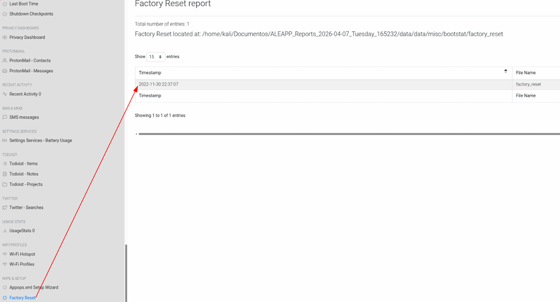

### **4. El día de Nochebuena de 2022 la usuaria recibió un código de verificación de Google. ¿Cuál fue ese código?**

El código de verificación de Google recibido por la usuaria el día de Nochebuena de 2022 fue **G-402852**. Una vez dentro de la sección SMS Messages, para acelerar la búsqueda se filtra por la palabra “code”:
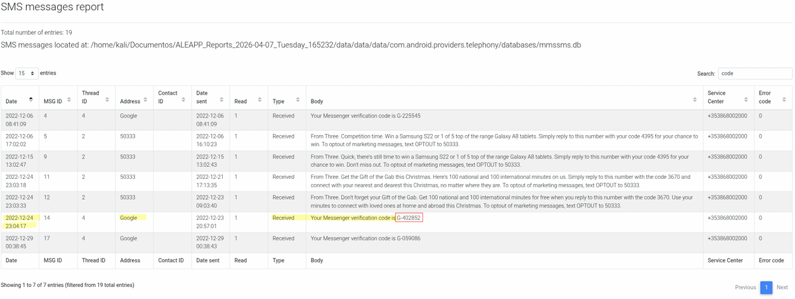

### **5. La usuaria hizo una búsqueda mediante Chrome sobre una aplicación para rootear el móvil. ¿Cuál es la aplicación y cuándo hace la búsqueda?**

La aplicación para rootear el móvil que la usuaria buscó mediante Chrome es **Magisk Manager**. Esta información se extrae del historial de Chrome, guardado en *data/data/data/com.android.chrome/app_chrome/Default/History*:
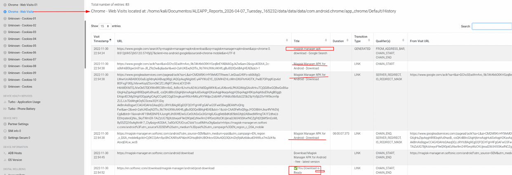

Si buscamos en un navegador la misma búsqueda vemos que sale la app y que sirve para rootear móviles:
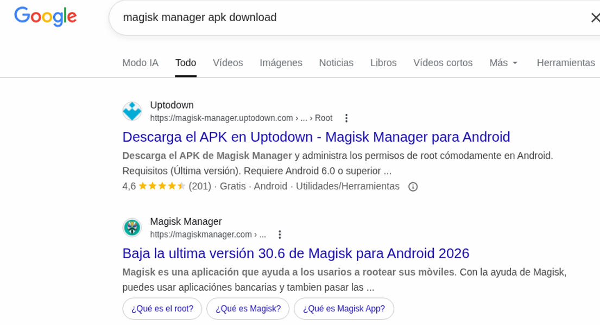

### **6. ¿A quién le manda un correo acerca de países de alto riesgo?**

La usuaria Tina Louis([tlouis@kurvalis.com](mailto:tlouis@kurvalis.com)) le manda un correo acerca de países de alto riesgo a **Michael Borchardt([mborchardt@kurvalis.com](mailto:mborchardt@kurvalis.com))**. Lo encontramos fácilmente filtrando con la palabra “high risk” en la sección Gmail-App Emails:
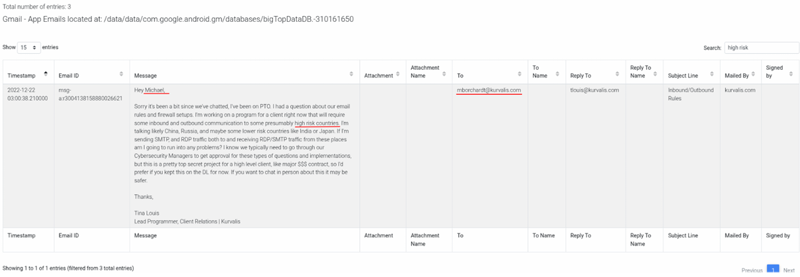

### 7. ¿Cuál es la contraseña de la cuenta de correo [wilts1991@protonmail.com](mailto:wilts1991@protonmail.com) accedida mediante Chrome? 

Para buscar la contraseña vamos a la sección Chrome-Login Data. En la columna “Password” está la contraseña de la cuenta de correo [wilts1991@protonmail.com](mailto:wilts1991@protonmail.com) : **Suam6is3eik**
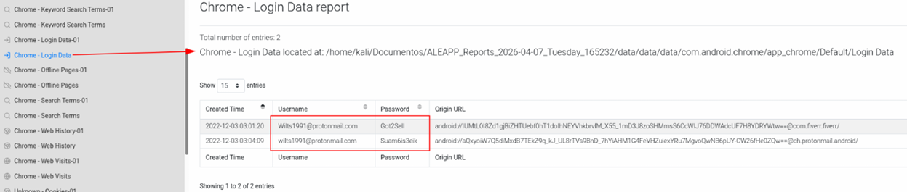

### **8. ¿En qué zona horaria estaba la usuaria en el último registro que existe del nivel de batería del móvil?** 

Vamos a la sección Turbo-Phone Battery y la columna Timestamp la filtramos para ver las entradas más recientes primero(flecha color negro hacia abajo). Analizando el último registro del nivel de batería del móvil, la usuaria estaba en la zona horaria de **America/Denver**. La bbdd con esta información se almacena en _/data/user/0/com.google.android.apps.turbo/databases/turbo.db_:
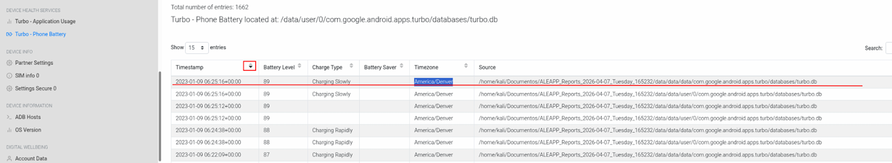

### **9. ¿Puedes citar alguna rutina personal que la usuaria tenga añadida a sus listas ToDo?** 

Una rutina personal que la usuaria tiene añadida a sus listas ToDo es **“Vacuum clean all rooms”** (Pasar el aspirador a todas las habitaciones), y también indica “every other day”(cada dos días).

Se puede ver en la sección Todoist-Items de la captura siguiente
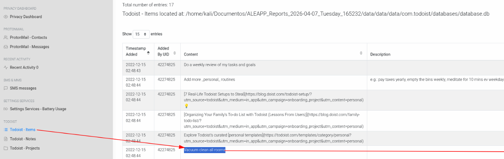
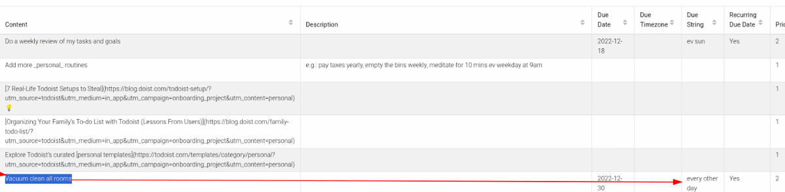

Otra rutina personal añadida por la usuaria es **“Do a weekly review of my tasks and goals”** (Hacer una reseña semanal de mis tareas y objetivos), además indica que la rutina la hace cada domingo(ev sun = every sunday).
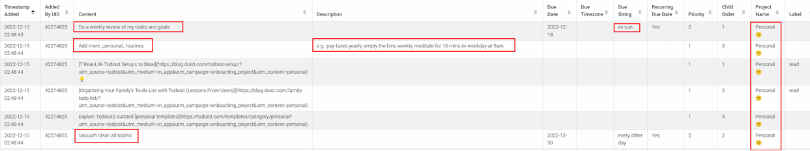

### **10. La usuaria sacó varias fotos y un vídeo en su visita a un museo. ¿De qué museo se trata?** 

Buscamos en la ruta habitual en la que se guardan las fotos y vídeos sacadas con la cámara en un Android, DCIM que está en la ruta _/storage/emulated/0/DCIM/Camera/_ . En una de las fotos aparece el autor y título de una obra. Se procede a buscar en un navegador este título y lo tenemos, se trata del **museo National Gallery of Ireland, ubicado en Dublín**.
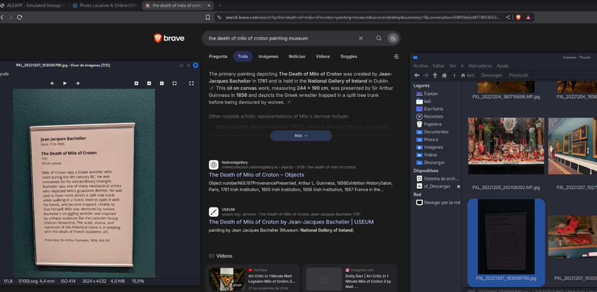
Si entramos en el enlace del sitio oficial del museo vemos el cuadro al que la usuaria le sacó la foto:
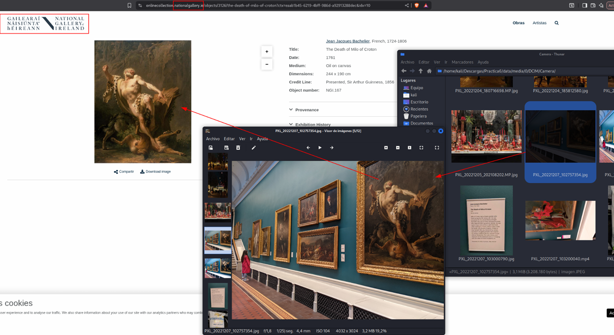
